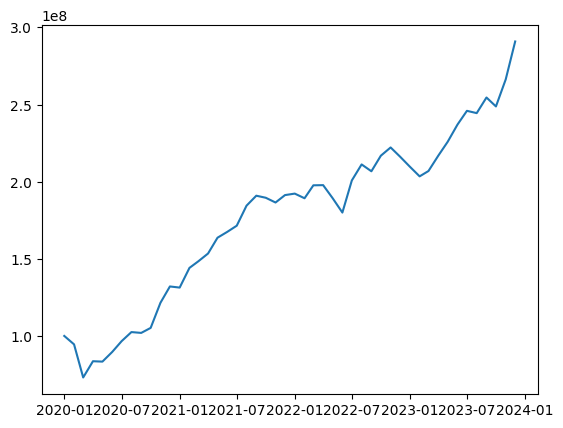

# AlgoBacktest

A platform for developing and evaluating algorithmic trading strategies.
Supports multi-asset portfolios with flexible signal generation and position sizing.
Emphasizes robust backtesting, risk-aware design, and extensible architecture.

## Features

- Modular Backtesting Engine
- Config-Driven Framework
- Multi-Asset Portfolio Support: Fetches data from yfinance
- Decoupled Signal & Execution Logic
- Time-Series Simulation Engine
- Performance & Risk Metrics

## Installation

### Prerequisites
- Python 3.x

### Steps
1. Clone the repository:
   ```
   git clone <your-repo-url>
   cd backtesting
   ```

2. Create and activate a virtual environment (recommended):
   ```
   python -m venv venv
   # On Windows:
   venv\Scripts\activate
   # On macOS/Linux:
   source venv/bin/activate
   ```

3. Install dependencies:
   ```
   pip install -r requirements.txt
   ```

## Usage

Import the `Engine` class from `engine.backtest_engine`, initialize with your parameters, run the backtest, and retrieve performance metrics or plots.

## Examples

### Basic Backtest Setup
```python
from engine.backtest_engine import Engine
import datetime

# Initialize the engine with custom parameters
engine = Engine(
    universe='NIFTY50',
    initial_capital=100000,
    start_date=datetime.date(2020, 1, 1),
    end_date=datetime.date(2023, 1, 1),
    interval='1mo'
)

# Run the backtest
engine.run_backtest()

# Get performance plot
performance_plot = engine.get_performance()
```

### Running a Custom Strategy
The engine defaults to `EqualWeightedStrategy`, but you can pass a custom strategy instance.

## Project Structure

- `data/`: Data handling modules
  - `data_loader.py`: Loads and validates financial data
  - `securities.py`: Defines security universes (e.g., NIFTY50)
- `engine/`: Core backtesting components
  - `backtest_engine.py`: Main engine for running backtests
  - `portfolio.py`: Portfolio tracking and trade execution
- `strategies/`: Trading strategy implementations
  - `base_strategy.py`: Base class for strategies
  - `equal_weighted.py`: Equal-weighted strategy example
- `main.py`: Entry point script (currently empty)

## Technologies Used

- Python
- pandas
- yfinance
- matplotlib

## Demo/Results

Below is a sample performance plot from a backtest using the equal-weighted strategy on NIFTY50 data from 2020-2023:



*Interpretation*: The plot illustrates the portfolio's value growth over time, demonstrating the strategy's performance against historical data. Peaks and valleys reflect market conditions and rebalancing effects.

## Author

Dhruvi Doshi
